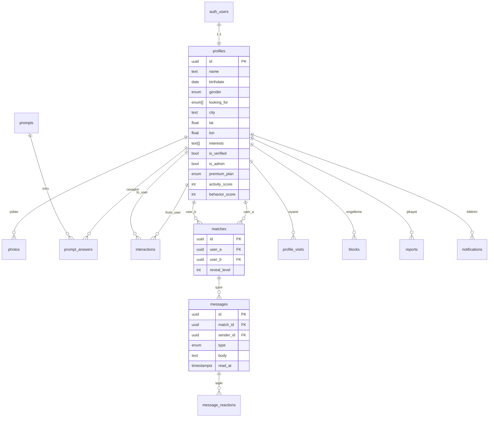

# Ahenk — "Önce ruh, sonra yüz."

Karaktere, ilgi alanlarına ve yaşam tarzına göre tanışma uygulaması. Fotoğraflar
ilk ekranda **bulanıktır**; önce kişilik ve ortak ilgi yüzdesi görünür, sohbet
ilerledikçe fotoğraf netleşir.

**Stack:** Next.js 14 (App Router) · TypeScript · Tailwind CSS · Framer Motion ·
Supabase (Auth + PostgreSQL + Storage + Realtime).

---

## 1) Kurulum (sıfırdan, adım adım)

### Adım 1 — Supabase projesi aç
1. https://supabase.com → ücretsiz hesap → **New Project**.
2. Proje açılınca **SQL Editor**'ı aç, `supabase/schema.sql` dosyasının tamamını
   yapıştır ve **Run** de. (Tüm tablolar, güvenlik politikaları, tetikleyiciler ve
   Storage kovaları otomatik kurulur.)
   Ardından `supabase/schema_v2.sql` dosyasını da yapıştırıp **Run** de — bu, v2
   özelliklerini (vibe, ses kartı, hikayeler, etkinlikler, moments, moderasyon,
   buz kırıcılar, affinity) ekleyen **additive** (mevcut yapıyı bozmayan) göçtür.
   Ardından **`supabase/schema_v3.sql`'i de yapıştırıp Run de** — streak, davet/referans
   ve günlük aktivite (retention) tablolarını ekler. ⚠️ Bu göç çalıştırılmazsa profil
   sayfası ve `/api/home` (streak/görevler/davet) hata verir.
   **En son `supabase/schema_v4_security.sql`'i yapıştırıp Run de** — KVKK/GDPR güvenlik
   sertleştirmesi: `photos` kovasını PRIVATE yapar, public `previews` (bulanık) kovasını açar,
   profilleri owner-only SELECT'e çeker ve güvenli `profiles_card` view'ını oluşturur.
   🔐 Bu göç çalıştırılmazsa keşif fotoğrafları boş gelir ve eşleşme/ziyaretçi/moment/story
   sayfaları (profiles_card'a bağlı) hata verir.
3. **Project Settings → API** sayfasından şunları kopyala:
   - `Project URL`
   - `anon public` anahtarı
   - `service_role` anahtarı (gizli!)

### Adım 2 — Ortam değişkenleri
Proje kökünde `.env.local.example` dosyasını `.env.local` olarak kopyala ve doldur:
```
NEXT_PUBLIC_SUPABASE_URL=...
NEXT_PUBLIC_SUPABASE_ANON_KEY=...
SUPABASE_SERVICE_ROLE_KEY=...
NEXT_PUBLIC_SITE_URL=http://localhost:3000
```

### Adım 3 — Çalıştır
```bash
npm install
npm run dev
```
→ http://localhost:3000

### Adım 4 — (İsteğe bağlı) Google / Apple girişi
Supabase → **Authentication → Providers** altından Google/Apple'ı aç ve ilgili
geliştirici konsolundan client id/secret gir. Callback URL:
`https://<proje>.supabase.co/auth/v1/callback`. E-posta girişi kutudan çalışır.

### Adım 5 — Kendini admin yap
Supabase → Table editor → `profiles` → kendi satırında `is_admin = true` yap.
Sonra uygulamada Profil → Admin Paneli görünür.

### Adım 6 — (Production için ZORUNLU) Custom SMTP
Kayıt doğrulama e-postaları Supabase Auth tarafından gönderilir. Supabase'in yerleşik
e-posta servisi **yalnız geliştirme içindir** (saatte ~2-4 mail limiti). Production/kapalı
beta için **custom SMTP şart**. Önerilen: **Resend** (en az operasyon yükü). Kurulum:
Supabase → **Authentication → SMTP Settings** → Resend host/port/user/pass gir. Adım adım
rehber ve sağlayıcı karşılaştırması (Resend vs Postmark vs SendGrid): **`ENVIRONMENT.md`**.

### Adım 7 — (Mobil yayın için) Abonelik: App Store + Google Play
Free / Plus / Premium Plus abonelikleri **mağaza üzerinden** satılır. Mimari: **RevenueCat +
Capacitor + Supabase** (receipt doğrulaması RevenueCat'te; webhook → `apply_subscription_event`
→ `profiles.premium_plan`). DB katmanı kurulu (`schema_v7_subscriptions.sql`), webhook hazır
(`/api/webhooks/revenuecat`), premium ekranı native'de satın alır / web'de uygulamaya yönlendirir.
Ortam değişkenleri: `REVENUECAT_WEBHOOK_AUTH`, `NEXT_PUBLIC_RC_IOS_KEY`, `NEXT_PUBLIC_RC_ANDROID_KEY`.
- Tam kurulum (RevenueCat + mağaza ürün listeleri + Capacitor + test): **`SUBSCRIPTIONS.md`**
- Adım adım yayın listesi: **`MOBILE-LAUNCH.md`**
- Web (gerçek para → jeton, opsiyonel Stripe): **`PAYMENTS.md`**

### Adım 8 — (Mobil) Sesli / Görüntülü görüşme (TURN)
Eşleşen kullanıcılar **WebRTC P2P** ile görüşür (Plus sesli, Premium Plus görüntülü). Medya
sunucudan geçmez; sinyalizasyon Supabase Realtime. STUN ücretsiz (Google) gömülü; **TURN
production'da şart** (NAT arkası). ENV: `NEXT_PUBLIC_TURN_URL/USER/CRED`. Sağlayıcı seçimi,
kurulum ve iOS/Android izinleri: **`CALLS.md`**.

### Keşfet (yenilendi)
Mesafe sıralı (aynı şehir → yakın → uzak), **SQL-seviyesi** mesafe/şehir filtresi (Tinder benzeri
slider 5km–Türkiye geneli + çoklu şehir + arama), sonuç sayısı, online/yeni rozetleri, premium
çerçeve/rozet. Filtreler `discover_candidates()` SQL fonksiyonunda (frontend filtreleme yok).

---

## 2) ER Diyagramı



---

## 3) Dosya Yapısı

```
ahenk/
├─ supabase/schema.sql          # tüm şema + RLS + trigger + storage
├─ middleware.ts                # oturum yenileme + rota koruması
├─ lib/
│  ├─ supabase/{client,server,middleware}.ts
│  ├─ utils.ts                  # haversine mesafe, ortak ilgi %, yaş
│  ├─ matchScore.ts             # Ahenk eşleşme algoritması (0-100)
│  ├─ moderation.ts             # spam filtresi + sahte hesap risk skoru
│  ├─ constants.ts              # 81 il, ilgi alanları, mini sorular
│  └─ types.ts
├─ components/
│  ├─ theme-provider.tsx        # koyu/açık tema
│  ├─ ui.tsx                    # Button, Input, Chip, Badge
│  ├─ BottomNav.tsx
│  ├─ ProfileActions.tsx
│  └─ ChatWindow.tsx            # gerçek zamanlı sohbet
├─ app/
│  ├─ layout.tsx · globals.css · page.tsx
│  ├─ (auth)/login · register
│  ├─ auth/callback/route.ts    # OAuth dönüşü
│  ├─ onboarding/               # çok adımlı profil + foto yükleme
│  ├─ (app)/                    # alt menülü korumalı alan
│  │  ├─ kesfet/                # karakter-öncelikli kart destesi
│  │  ├─ eslesmeler/
│  │  ├─ sohbet/[matchId]/
│  │  ├─ profil/ · ziyaretciler/ · premium/
│  ├─ admin/                    # admin paneli (is_admin korumalı)
│  └─ api/
│     ├─ discover/route.ts      # skorlanmış aday listesi
│     └─ interact/route.ts      # etkileşim + ziyaret + eşleşme
```

---

## 4) API Yapısı

| Yöntem | Yol | Açıklama |
|---|---|---|
| GET  | `/api/discover` | İlgi/yaş/konum/aktivite/davranışa göre skorlanmış adaylar |
| POST | `/api/interact` | `{to_user, type}` — etkileşim kaydeder, eşleşme oluşur mu döner |
| GET  | `/auth/callback` | OAuth/e-posta doğrulama dönüşü |

Mesajlaşma, reaksiyon, engelleme, şikayet, premium ve ziyaret işlemleri RLS
politikaları sayesinde doğrudan Supabase istemcisiyle güvenle yapılır (ekstra API
gerekmez). Gerçek zamanlılık Supabase **Realtime** (postgres_changes) ile.

### Güvenlik
- **RLS** her tabloda açık: kullanıcı yalnızca kendi verisine ve eşleştiği kişiyle
  paylaşılan mesajlara erişir.
- **JWT**: Supabase Auth oturum token'ı middleware'de her istekte doğrulanır.
- **Spam filtresi**: `lib/moderation.ts` mesaj gönderiminde bağlantı/iletişim/spam
  kalıplarını engeller.
- **Sahte hesap riski**: foto/bio/ilgi/hesap yaşı/şikayet sinyallerinden 0-100 risk.
- **Davranış puanı**: şikayet aldıkça düşer (DB tetikleyicisi), eşleşme skorunu etkiler.

---

## 5) Eşleşme Algoritması (`ahenkSkoru`)
```
%40 ilgi + hobi benzerliği (Jaccard)
%20 yaş uyumu
%20 konum yakınlığı (Haversine km)
%10 aktivite düzeyi
%10 davranış puanı
```

---

## 6) Production Deployment (Vercel)
1. Kodu GitHub'a push et.
2. https://vercel.com → **Import Project** → repoyu seç.
3. Environment Variables'a `.env.local`'deki 4 değişkeni gir
   (`NEXT_PUBLIC_SITE_URL`'i gerçek domain'inle değiştir).
4. Deploy. Supabase → Authentication → **URL Configuration**'a production
   domain'ini Site URL ve Redirect URLs olarak ekle.
5. Storage `photos` kovası **PRIVATE** (orijinaller yalnız sunucuda imzalı URL ile, eşleşme +
   tam reveal sonrası sunulur); keşifteki bulanık önizlemeler public `previews` kovasından gelir.

---

## 7) Şu an çalışan vs. sıradaki adımlar
**Çalışıyor (v1):** kayıt/giriş (e-posta + Google/Apple altyapısı), çok adımlı profil +
çoklu foto, karakter-öncelikli keşif + bulanık foto + ortak ilgi %, 4 etkileşimli
niyet sistemi, karşılıklı eşleşme, gerçek zamanlı mesaj + reaksiyon + okundu,
engelleme/şikayet, premium yükseltme (demo), kimler ziyaret etti, admin paneli,
koyu/açık tema, spam + sahte hesap + davranış puanı.

**Çalışıyor (v2 — yeni):** günlük mod (vibe, 24s otomatik sıfırlama, keşifte rozet),
30 sn sesli tanıtım kartı (MediaRecorder → `media` kovası, keşifte oynatma), eşleşme
başına AI buz kırıcı sorular (sohbet boş ekranında), gizli **enerji puanı** (eşleşme
algoritmasına dahil), **Hikayeler** (24s, keşfet üstü bar + görüntüleyici), **Etkinlikler**
(yakındaki kullanıcılara katılma isteği), onboarding'de AI profil önerileri, sahte hesap
risk skoru + **moderasyon kuyruğu** (admin), **Premium Plus** (platinum) katmanı,
**Analitik paneli** (DAU, eşleşme/premium dönüşümü, churn, mesaj istatistikleri),
**Moments / Canlı Anlar** (ayrı sekme, beğen/ilginç/kaydet, 24s otomatik silinme,
AI etiketleri → eşleşmeye geri besleme, öne çıkan momentler).

> Not: "AI" özellikleri (buz kırıcı, profil önerisi, moment etiketleri) bir LLM anahtarı
> gerektirmeyen, kural-tabanlı/deterministik motorlardır. İstersen gerçek bir LLM'e bağlanır.

**Sıradaki (birlikte etlendireceğiz):** sohbette foto/sesli mesaj gönderimi,
gerçek ödeme entegrasyonu (iyzico/Stripe), push bildirim, gelişmiş admin moderasyon
aksiyonları (onayla/engelle), profil doğrulama akışı (selfie).
```
